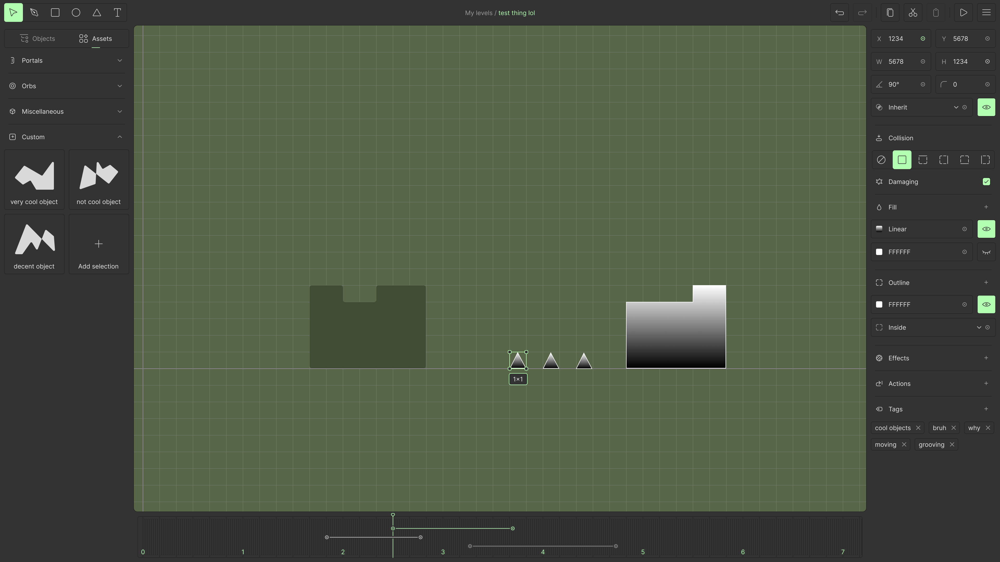
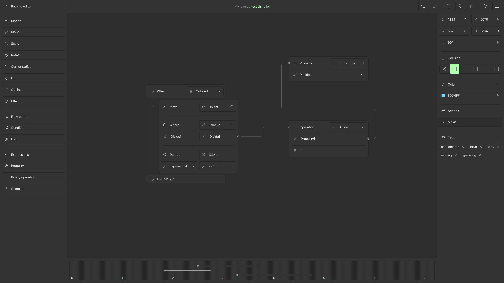

[< На главную](index.md)

# Возможности редактора

На этой странице будут описаны основные возможности редактора, а также игровые объекты и их свойства.

- [Инструменты](#инструменты)
- [Игровые объекты](#игровые-объекты)
- [Материалы](#материалы)
- [Эффекты](#эффекты)
- [Инспектор](#инспектор)
- [Временная шкала](#временная-шкала)
- [Концепты дизайна](#концепты-дизайна)

## Инструменты

Инструменты используются для взаимодействия курсора с миром уровня. У каждого инструмента есть действия на клик и
перетягивание.

| Иконка                    |  Название  | Применение                                                             |
|---------------------------|:----------:|:-----------------------------------------------------------------------|
|  | **Курсор** | Выделяет и перемещает объекты.                                         |
|        | **Ручка**  | Рисует сложные фигуры с помощью прямых отрезков или кривых Безье.      |
|      | **Фигура** | Рисует простую фигуру (прямоугольник, овал, правильный многоугольник). |
|      | **Текст**  | Рисует текст.                                                          |

## Игровые объекты

Игровые объекты находятся внутри мира уровня и могут так или иначе взаимодействовать с игроком. Эти взаимодействия
описаны в таблице ниже. У всех объектов есть свойства, некоторые из которых могут быть анимированы. Также некоторые
объекты могут находиться на временной шкале (timeline), о которой будет рассказано позже.

Некоторые объекты можно создать с помощью панели инструментов, остальные - через левую панель. Также можно сохранять
собственные объекты на левую панель для быстрого создания (своего рода префабы).

Несмотря на желание предоставить бесконечный потенциал для создателей уровней, наличие такого потенциала может привести
к созданию непонятных для других игроков уровней. В целях устранения необходимости постоянного обучения игровым
механикам некоторые из них будут реализованы с помощью специальных объектов, которые будут легко узнаваемы в любом
уровне.

|          Название           | Описание                                                                                                                                                                                                                                                                                                                                                                    | Отличия в ритм-режиме                                                                             |
|:---------------------------:|-----------------------------------------------------------------------------------------------------------------------------------------------------------------------------------------------------------------------------------------------------------------------------------------------------------------------------------------------------------------------------|---------------------------------------------------------------------------------------------------|
|         **Фигура**          | Объект, составляющий большинство ландшафта уровня. К фигуре может быть применено большинство трансформаций, в т.ч. перемещение, вращение, изменение размера и искажение. В качестве заливки и контура могут применены сплошные цвета, градиенты, текстуры и их сочетания. Объект может иметь физическое тело для столкновения с игроком, либо оставаться просто декорацией. | При столкновении с игроком сбоку убивает игрока вне зависимости от флага `damaging`.              |
|         **Триггер**         | Невидимый объект, служащий лишь активатором действий при столкновении с игроком. К триггеру может быть применено большинство трансформаций. У триггера нет физического тела. Может находиться на временной шкале для применения действия в определенный момент времени.                                                                                                     | Нет                                                                                               |
|         **Группа**          | Технический объект, который собирает в себя несколько объектов. Свойства дочерних объектов будут реализованы относительно родительской группы. К группе можно применить все трансформации, они будут отражены на дочерних объектах.                                                                                                                                         | Нет                                                                                               |
|          **Текст**          | Декоративный объект, показывающий набранный текст. К тексту могут быть применены те же трансформации и заливки, что к фигуре. В качестве текста могут быть использованы переменные.                                                                                                                                                                                         | Нет                                                                                               |
|        **Чекпоинт**         | Объект, который при столкновении с игроком сохраняет текущие свойства мира и игрока, чтобы при смерти игрока начать новую попытку с сохраненного состояния. Имеет настраиваемую зону действия.                                                                                                                                                                              | Нет                                                                                               |
|          **Финиш**          | Объект, который при столкновении с игроком завершает уровень. Имеет настраиваемую зону действия.                                                                                                                                                                                                                                                                            | Нет                                                                                               |
|         **Монета**          | Объект, который при столкновении с игроком "подбирается". В сюжетной кампании монеты будут внутриигровой валютой, которой можно воспользоваться в магазине. Для пользовательских уровней значение монеты пока не придумано.                                                                                                                                                 | Нет                                                                                               |
|        **Трамплин**         | Несколько объектов, которые при столкновении с игроком мгновенно применяют силу в направлении, заданном вращением объекта. В ряде объектов будут присутствовать трамплины различной силы, отличимые, скорее всего, цветом. К трамплину могут быть применены некоторые трансформации.                                                                                        | Применяют только вертикальную силу (строго вверх и строго вниз), направление зависит от вращения. |
| **Гравитационный трамплин** | Объект, который при столкновении с игроком меняет гравитацию игрока и применяет силу, чтобы игрок сразу оттолкнулся в направлении гравитации. Гравитация может меняться в одном из четырех направлений: вниз, вверх, влево и вправо. Направление зависит от вращения, будет выбрано ближайшее.                                                                              | Меняет гравитацию только вверх и вниз.                                                            |
|       **Вентилятор**        | Объект, который применяет постоянную силу к игроку в направлении, заданном вращением, пока игрок находится в зоне его действия. Может быть переключен в несколько состояний мощности, которые будут обозначаться цветом и/или скоростью частиц.                                                                                                                             | Применяет только вертикальную силу, которая убывает при вращении вбок.                            |

## Материалы

К фигурам с физическим телом может быть применен один из материалов, которые влияют на взаимодействие игрока с объектом.
В таблице ниже описаны свойства этих материалов.

|      Название       | Свойства                                                                                                                                                                                                                                    |
|:-------------------:|---------------------------------------------------------------------------------------------------------------------------------------------------------------------------------------------------------------------------------------------|
|     **Обычный**     | Стоя на объекте, игрок постепенно разгоняется при движении и постепенно замедляется при остановке. При столкновении со стеной просто прекращает горизонтальное движение.                                                                    |
|       **Лёд**       | Время разгона и замедления значительно увеличены для создания эффекта скольжения.                                                                                                                                                           |
| **Мёд** (или слизь) | Максимальная скорость и высота прыжка игрока значительно уменьшены для создания эффекта прилипания. При столкновении со стеной вертикальное движение значительно замедлено.                                                                 |
|  **Зыбучий песок**  | Максимальная скорость и высота прыжка игрока очень сильно уменьшены. Игрок постепенно проваливается внутрь объекта, что может быть предотвращено постоянными прыжками.                                                                      |
|      **Вода**       | Максимальная скорость и высота прыжка незначительно уменьшены. Гравитация значительно уменьшена для создания эффекта сопротивления воды. Игрок может пройти внутрь объекта с любой стороны, при этом действие флага `damaging` сохраняется. |

> Изменения скорости не влияют на игрока в ритмичном режиме.

## Эффекты

К объектам и окружению могут быть применены различные эффекты. Какие это будут конкретно эффекты, зависит от технических
возможностей Skia, но планируются такие, как размытие, рябь, вздутие и другие.

## Инспектор

Инспектор - правая панель редактора, на которой расположены сведения об объекте - положение, размер и другие свойства.
Эти свойства можно задать и изменить, а также закрепить ключевой кадр на временной шкале.

## Временная шкала

Временная шкала используется для анимации объектов и размещения некоторых триггеров. С ее помощью можно редактировать
ключевые кадры, которые создаются в инспекторе: время кадра, функцию плавного перехода между кадрами (easing).

На временной шкале расположен индикатор текущего времени, который можно перемещать, чтобы увидеть текущие значения
анимаций по ключевым кадрам. Эти значения отобразятся в инспекторе, и их можно закрепить в отдельный ключевой кадр.

Также на временную шкалу можно расположить триггер. Такой триггер безусловно активируется в поставленный момент времени.

## Концепты дизайна

(стиль не финальный, да и ничего не финально)

